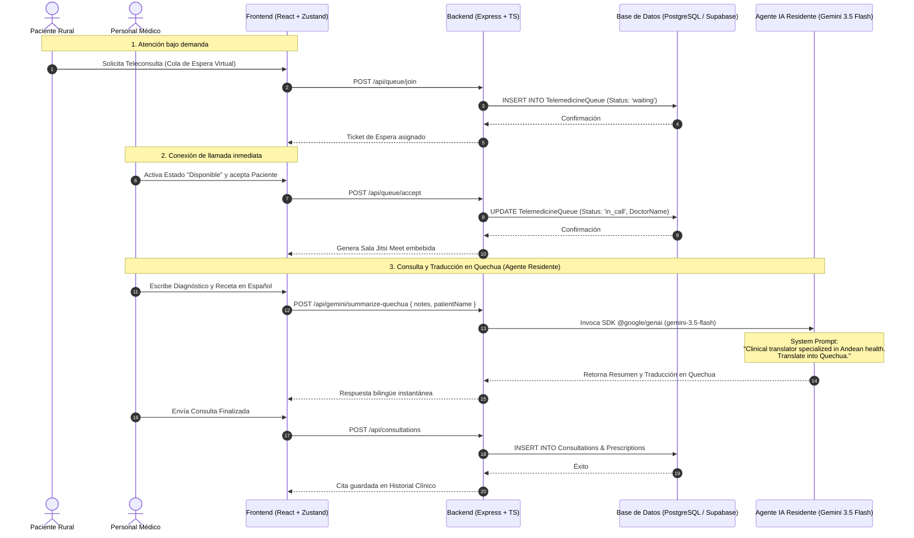

# Informe de Proyecto: Sumaq Qhali (Telemedicina Rural Andina)
## Desarrollo de Sistemas Tradicionales Co-Diseñados con IA

Este informe documenta el desarrollo y la arquitectura del sistema **Sumaq Qhali** (del quechua: *Buena Salud*), una plataforma de telemedicina rural andina diseñada y desarrollada utilizando técnicas de IA Agéntica y arquitectura de sistemas tradicionales (Frontend + Backend + Base de Datos Relacional).

---

## Hito 1: Prompt Engineering & Arquitectura Agéntica

### 1.1 Diagrama de Arquitectura
El siguiente diagrama detalla cómo interactúa el cliente (médico, paciente y administrador), el servidor backend en Express, la base de datos relacional PostgreSQL en Supabase, y el **Agente Residente de IA** (Gemini 3.5 Flash) que provee traducciones clínicas y análisis de recetas al quechua.



### 1.2 Diagrama de Componentes y Flujo de Interacción de la IA
El siguiente diagrama de bloques ilustra la arquitectura lógica y física de la aplicación, destacando los límites del sistema tradicional (Backend + DB relacional) y los puntos de integración con el **Agente Residente en Runtime** (Gemini API) y los **Agentes de Desarrollo en Fase de Diseño** (Google AI Studio):

```mermaid
graph TD
    %% Estilos de nodos
    classDef client fill:#e0f2fe,stroke:#0284c7,stroke-width:2px,color:#0369a1;
    classDef backend fill:#fef3c7,stroke:#d97706,stroke-width:2px,color:#92400e;
    classDef database fill:#ecfdf5,stroke:#059669,stroke-width:2px,color:#065f46;
    classDef ai fill:#f3e8ff,stroke:#7c3aed,stroke-width:2px,color:#5b21b6;
    classDef external fill:#f3f4f6,stroke:#4b5563,stroke-width:2px,color:#1f2937;

    %% Componentes
    subgraph Capa_Cliente [Capa del Cliente - Frontend React]
        PortalPac[Portal del Paciente]:::client
        DashMed[Dashboard del Médico]:::client
        StateStore[Zustand State Store]:::client
    end

    subgraph Capa_Negocio [Capa del Servidor - Backend Express]
        Router[Router REST API]:::backend
        AuthMiddle[JWT Auth Middleware]:::backend
        AIService[AI Service Client]:::backend
        DBClient[pg Connection Pool]:::backend
    end

    subgraph Capa_Datos [Capa de Persistencia - PostgreSQL]
        DB_Queue[(Cola Telemedicina)]:::database
        DB_Clin[(Historial Clínico: Consultas/Recetas)]:::database
        DB_MedMaster[(Catálogo de Medicamentos)]:::database
        DB_Users[(Pacientes & Credenciales)]:::database
    end

    subgraph Capa_Cognitiva [Capa de Agentes de IA]
        AgentRes[Agente Residente: Translator AI - Gemini 3.5 Flash]:::ai
        AgentDev[Agentes de Desarrollo - AI Studio Code Gen & Refactor]:::ai
    end

    subgraph Servicios_Externos [Servicios de Terceros]
        JitsiAPI[Jitsi Meet Video API]:::external
    end

    %% Relaciones de Diseño (Development Time)
    AgentDev -.->|1. Genera Schema SQL & Endpoints| Capa_Negocio
    AgentDev -.->|1. Estructura Tablas Relacionales| Capa_Datos

    %% Relaciones en Tiempo de Ejecución (Runtime)
    DashMed -->|2. Envía Receta & Notas de Consulta| Router
    Router --> AuthMiddle
    AuthMiddle --> AIService
    
    %% Interacción del Agente de IA con el Backend y la DB
    AIService <=>|3. Lógica Contextualizada via HTTPS / SDK| AgentRes
    AIService -->|4. Alimenta contexto con historial previo| DBClient
    DBClient <=>|5. Lee/Escribe Registros| Capa_Datos

    %% Integraciones
    PortalPac -->|6. Polling Sala Virtual| DB_Queue
    PortalPac & DashMed -->|7. Embed Jitsi Video| JitsiAPI
    
    %% Asignación de clases
    class PortalPac,DashMed,StateStore client;
    class Router,AuthMiddle,AIService,DBClient backend;
    class DB_Queue,DB_Clin,DB_MedMaster,DB_Users database;
    class AgentRes,AgentDev ai;
    class JitsiAPI external;
```

#### Descripción Detallada de la Interacción del Agente de IA:

1.  **Interacción del Agente de IA con el Backend:**
    *   La comunicación se realiza mediante protocolo seguro **HTTPS** empleando la librería oficial `@google/genai` del servidor Node.js.
    *   Cuando el médico guarda una consulta en el [Dashboard del Médico](file:///C:/Users/efrai/Desktop/Sistemas/sumaq-qhali/src/components/DoctorDashboard.tsx), el frontend envía una solicitud al endpoint `/api/gemini/summarize-quechua`.
    *   El backend actúa como **orquestador principal**: intercepta la consulta, verifica la autenticación JWT del médico, sanitiza el texto y crea una petición hacia el modelo `gemini-3.5-flash` inyectando un **System Instruction** restrictivo que orienta el comportamiento de Gemini para que funcione como un asistente clínico andino bilingüe.

2.  **Interacción del Agente de IA con la Base de Datos:**
    *   **Lectura de Contexto:** Antes de invocar al agente de IA (Gemini), el backend puede consultar el historial clínico relacional (tablas `Patients`, `ChronicConditions` y `Allergies`) para enriquecer el contexto del paciente si fuera necesario (por ejemplo, previniendo al agente de sugerir remedios que colisionen con las alergias del paciente).
    *   **Persistencia:** Una vez que el agente de IA retorna el diagnóstico traducido al quechua, el backend no se limita a mostrarlo en pantalla; el flujo tradicional guarda las prescripciones detalladas en la tabla `Prescriptions` y el diagnóstico en la tabla `Consultations` de **PostgreSQL (Supabase)**. Esto garantiza que la información quede registrada permanentemente y esté disponible para futuras consultas sin requerir llamadas repetidas a la API de IA (ahorro de tokens y latencia).

3.  **Resiliencia Rural (Fallback local):**
    *   Dado que el sistema está diseñado para entornos andinos donde la conectividad a internet puede ser inestable, se implementó un mecanismo de desacoplamiento. Si la llamada al **Agente de IA Residente** falla (por latencia o corte de internet), el backend captura el error (`catch`) y responde de inmediato con una traducción en quechua estática de contingencia (*Fallback*) precargada en el servidor, evitando que la aplicación tradicional se congele o bloquee la atención del paciente rural.

---

### 1.3 Bitácora de Prompts (Prompt Log)

Durante las fases de co-diseño, se utilizaron diversos entornos de modelado cognitivo (Google AI Studio y Code Interpreters) para generar los módulos de software. A continuación, se detallan los System Prompts e instrucciones clave que permitieron estructurar el sistema de forma autónoma.

#### Prompt 1: Generación del Esquema Relacional de Base de Datos (SQL)
*   **Entorno:** Google AI Studio
*   **Modelo:** Gemini 1.5 Pro
*   **System Prompt / Rol:** "Eres un Arquitecto de Bases de Datos Senior y experto en PostgreSQL."
*   **Instrucciones del Prompt:**
    ```text
    Diseña un esquema de base de datos relacional normalizado para un sistema de telemedicina rural andina llamado "Sumaq Qhali". 
    El sistema debe soportar:
    1. Registro de Pacientes (incluyendo DNI único, historial clínico, localización rural, tipo de sangre y contraseñas seguras).
    2. Cola de espera virtual de Telemedicina en tiempo real (para triage virtual de atención inmediata).
    3. Turnos de médicos (DoctorShifts) con control de días de la semana y horas de disponibilidad.
    4. Expedientes de consultas, prescripciones detalladas, alergias y condiciones crónicas.
    
    Genera el script SQL de creación compatible con PostgreSQL (Supabase), aplicando llaves primarias, llaves foráneas bien estructuradas e índices para optimizar las consultas por PatientID y DNI. Evita placeholders.
    ```

#### Prompt 2: Creación de Endpoints del Backend con Node.js & Express
*   **Entorno:** Open Code Interpreter
*   **Modelo:** Gemini 1.5 Pro
*   **System Prompt / Rol:** "Eres un Ingeniero Backend Senior experto en Node.js, Express, TypeScript y seguridad web."
*   **Instrucciones del Prompt:**
    ```text
    Basándote en el esquema de base de datos generado para PostgreSQL:
    1. Escribe un servidor backend modular en TypeScript usando Express.
    2. Implementa un sistema de autenticación seguro basado en JWT (JSON Web Tokens) diferenciando dos portales: Paciente (autenticación por DNI) y Personal Médico/Administración (por Nombre de Usuario).
    3. Utiliza la librería "pg" de Node.js para conectarte a la base de datos usando Connection Pools eficientes.
    4. Implementa mecanismos de manejo de errores robustos (try/catch globales) y fallbacks locales si la conexión a Supabase presenta latencias.
    ```

#### Prompt 3: System Prompt del Agente Clínico Residente (Traductor Bilingüe)
*   **Entorno:** Google AI Studio (Integrado directamente en el SDK `@google/genai` del backend)
*   **Modelo:** Gemini 3.5 Flash
*   **System Prompt (System Instruction):**
    ```text
    You are a clinical translator specialized in Andean health. 
    Your role is to translate and simplify medical diagnoses, notes, and prescriptions written in Spanish by doctors into Cusco-Quechua.
    
    Guidelines:
    1. Use clear, warm, and culturally appropriate language for rural communities.
    2. Keep the medical core of the prescription intact (e.g. dosages, medications) but explain it simply.
    3. Return a consolidated bilingüe summary (Spanish / Quechua) so that the patient can read their medical instructions clearly.
    4. Do not include technical jargon in Quechua that the patient won't understand. Use terms related to traditional or community care if helpful to bridge the gap.
    ```

---

## Hito 2: El Sistema Funcional

### 2.1 Código Fuente y Estructura del Proyecto

El sistema está estructurado como una aplicación monorítica moderna de alto rendimiento que integra el Frontend y el Backend en el mismo repositorio, facilitando el despliegue rápido y la consistencia de tipos:

*   **[`package.json`](file:///C:/Users/efrai/Desktop/Sistemas/sumaq-qhali/package.json):** Define los scripts del proyecto. Se utiliza **pnpm** como gestor de paquetes para garantizar la velocidad de instalación y el aislamiento de dependencias. El entorno corre mediante `tsx` (TypeScript Execute) en desarrollo y se empaqueta con `esbuild` para producción.
*   **[`server.ts`](file:///C:/Users/efrai/Desktop/Sistemas/sumaq-qhali/server.ts):** Alberga todo el servidor Express. Implementa la lógica de autenticación JWT, endpoints REST, las consultas SQL a Supabase y la integración directa con el SDK de Gemini.
*   **[`src/`](file:///C:/Users/efrai/Desktop/Sistemas/sumaq-qhali/src):** Carpeta raíz del Frontend en React.
    *   **[`src/components/PatientPortal.tsx`](file:///C:/Users/efrai/Desktop/Sistemas/sumaq-qhali/src/components/PatientPortal.tsx):** Portal web para los pacientes. Incluye su historial, recetas bilingües y el botón para unirse a la sala de espera virtual de Jitsi.
    *   **[`src/components/DoctorDashboard.tsx`](file:///C:/Users/efrai/Desktop/Sistemas/sumaq-qhali/src/components/DoctorDashboard.tsx):** Dashboard para el médico con switch de disponibilidad global en tiempo real y vista de teleconsulta dividida (Video Jitsi + Ficha Clínica).
    *   **[`src/components/AdministratorPanel.tsx`](file:///C:/Users/efrai/Desktop/Sistemas/sumaq-qhali/src/components/AdministratorPanel.tsx):** Panel administrativo que monitorea el rendimiento de la red clínica rural en tiempo real.
    *   **[`src/components/PatientClinicalRecord.tsx`](file:///C:/Users/efrai/Desktop/Sistemas/sumaq-qhali/src/components/PatientClinicalRecord.tsx):** Componente que renderiza el historial de consultas del paciente e integra el llamado al Agente de IA para traducción.

---

### 2.2 Script de Migración de la Base de Datos

La estructura relacional está diseñada en PostgreSQL y cuenta con un sistema de auto-migración y inicialización de semillas (*seeding*) automatizado al arrancar el servidor. El script SQL puro de migración generado y optimizado es el siguiente:

```sql
-- 1. Tabla de Pacientes (Normalizada)
CREATE TABLE IF NOT EXISTS Patients (
    PatientID VARCHAR(100) PRIMARY KEY,
    MedicalHistoryNumber VARCHAR(100),
    FullName VARCHAR(255) NOT NULL,
    Status VARCHAR(50) NOT NULL, -- 'Active', 'Inactive'
    Age INT,
    DNI VARCHAR(50) UNIQUE NOT NULL,
    BloodType VARCHAR(10),
    Location VARCHAR(255),
    Email VARCHAR(255),
    Phone VARCHAR(50),
    Gender VARCHAR(50),
    Password VARCHAR(255) NOT NULL, -- Encriptado con bcrypt
    AvatarURL VARCHAR(255)
);

-- 2. Tabla de Turnos Médicos (Planificación Dinámica)
CREATE TABLE IF NOT EXISTS DoctorShifts (
    ShiftID VARCHAR(100) PRIMARY KEY,
    DoctorName VARCHAR(255) NOT NULL,
    Specialty VARCHAR(255) NOT NULL,
    DayOfWeek INT NOT NULL, -- 0 (Domingo) a 6 (Sábado)
    SlotTime VARCHAR(100) NOT NULL, -- e.g. "09:00 AM"
    IsActive INT DEFAULT 1,
    ShiftDate VARCHAR(100) NULL -- Para turnos en fechas específicas
);

-- 3. Tabla de Cola de Telemedicina en Tiempo Real (Triage Virtual)
CREATE TABLE IF NOT EXISTS TelemedicineQueue (
    PatientID VARCHAR(100) NOT NULL PRIMARY KEY REFERENCES Patients(PatientID) ON DELETE CASCADE,
    FullName VARCHAR(255) NOT NULL,
    Location VARCHAR(255) NOT NULL,
    Status VARCHAR(50) NOT NULL, -- 'waiting', 'in_call'
    JoinedAt BIGINT NOT NULL,
    DoctorName VARCHAR(255) NULL
);

-- 4. Alergias del Paciente
CREATE TABLE IF NOT EXISTS Allergies (
    AllergyID VARCHAR(100) PRIMARY KEY,
    PatientID VARCHAR(100) REFERENCES Patients(PatientID) ON DELETE CASCADE,
    AllergyName VARCHAR(255) NOT NULL,
    Severity VARCHAR(50) NOT NULL -- 'low', 'medium', 'high'
);

-- 5. Condiciones Crónicas
CREATE TABLE IF NOT EXISTS ChronicConditions (
    ConditionID VARCHAR(100) PRIMARY KEY,
    PatientID VARCHAR(100) REFERENCES Patients(PatientID) ON DELETE CASCADE,
    ConditionName VARCHAR(255) NOT NULL,
    DiagnosedYear INT NOT NULL,
    Status VARCHAR(50) NOT NULL -- 'Active', 'Resolved'
);

-- 6. Consultas Clínicas
CREATE TABLE IF NOT EXISTS Consultations (
    ConsultationID VARCHAR(100) PRIMARY KEY,
    PatientID VARCHAR(100) REFERENCES Patients(PatientID) ON DELETE CASCADE,
    Date TIMESTAMP DEFAULT CURRENT_TIMESTAMP,
    CIE10Code VARCHAR(50), -- Código diagnóstico internacional
    DiagnosisTitle VARCHAR(255) NOT NULL,
    Notes TEXT NOT NULL, -- Nota clínica escrita por el médico
    CreatedBy VARCHAR(255) NOT NULL -- Nombre del médico tratante
);

-- 7. Prescripciones Médicas (Relación N:1 con Consultas)
CREATE TABLE IF NOT EXISTS Prescriptions (
    PrescriptionID VARCHAR(100) PRIMARY KEY,
    ConsultationID VARCHAR(100) REFERENCES Consultations(ConsultationID) ON DELETE CASCADE,
    MedicationName VARCHAR(255) NOT NULL,
    Dosage VARCHAR(255) NOT NULL,
    Duration VARCHAR(255) NOT NULL
);

-- 8. Catálogo de Medicamentos Maestros (Autocompletado)
CREATE TABLE IF NOT EXISTS Medicines (
    MedicineID VARCHAR(100) PRIMARY KEY,
    Name VARCHAR(255) UNIQUE NOT NULL,
    Category VARCHAR(100) NOT NULL -- 'Occidental' o 'Tradicional'
);
```

> [!NOTE]
> Para la carga inicial del sistema de demostración, el backend introduce automáticamente 5 pacientes semilla con historias clínicas y contraseñas pre-encriptadas (el DNI del paciente actúa como su contraseña por defecto en el demo), y un catálogo de 16 medicamentos occidentales y fitoterapias andinas tradicionales (como infusión de Muña, Eucalipto y mate de Coca) para evitar confusiones de escritura en las recetas.

---

### 2.3 La Funcionalidad Agéntica: Traductor Clínico Andino

La principal característica agéntica del sistema es el **Traductor Clínico Andino**, que consume los datos de la consulta ingresada por el médico y genera un resumen en lenguaje natural bilingüe (Español / Quechua). 

Esta funcionalidad se implementa en el backend Express mediante una ruta POST protegida y consume el modelo `gemini-3.5-flash` a través del SDK oficial `@google/genai`:

```typescript
// Endpoint del Agente Residente en server.ts
app.post("/api/gemini/summarize-quechua", async (req, res) => {
  const { notes, patientName } = req.body;
  if (!notes) return res.status(400).json({ error: "Notes required" });

  try {
    const ai = getGeminiClient();
    const promptMessage = `Summarize and translate the following clinical note for patient ${patientName || "Juan"}: "${notes}"`;
    
    const response = await ai.models.generateContent({
      model: "gemini-3.5-flash",
      contents: promptMessage,
      config: {
        systemInstruction: "You are a clinical translator specialized in Andean health. Translate into Quechua.",
        temperature: 0.7,
      }
    });
    
    res.json({ translatedText: response.text });
  } catch (error: any) {
    // Mecanismo de contingencia / Resiliencia ante fallos de red
    console.error("Gemini API Error:", error.message);
    res.json({ 
      translatedText: "[FALLBACK] Paqarin p'unchaypas allinllacha kawsanki. Allin kani nispa sayariy... (El servicio de traducción por IA no está disponible en este momento. Por favor, consulte con su promotor de salud local).", 
      warning: "Gemini API failed. Fallback loaded." 
    });
  }
});
```

En el frontend, el componente [`PatientClinicalRecord.tsx`](file:///C:/Users/efrai/Desktop/Sistemas/sumaq-qhali/src/components/PatientClinicalRecord.tsx) consulta esta ruta al momento de abrir la consulta clínica, garantizando que el paciente rural pueda leer de manera autónoma las indicaciones médicas en su lengua materna:

```typescript
const handleTranslate = async (notesText: string) => {
  setLoadingTranslate(true);
  try {
    const res = await fetch("/api/gemini/summarize-quechua", {
      method: "POST",
      headers: { "Content-Type": "application/json" },
      body: JSON.stringify({ notes: notesText, patientName: patient.FullName })
    });
    const data = await res.json();
    setQuechuaSummary(data.translatedText);
  } catch (err) {
    console.error("Error fetching AI translation", err);
  } finally {
    setLoadingTranslate(false);
  }
};
```

---

## Hito 3: Defensa y Demostración (Preparación)

### 3.1 Lecciones Aprendidas: Logros de la IA Co-Programadora
1.  **Agilidad de Desarrollo:** La IA generó un esquema relacional normalizado con PostgreSQL en minutos, permitiendo al equipo concentrarse en la lógica de negocio y en la integración de WebRTC con Jitsi Meet.
2.  **Traducción Especializada de Alto Nivel:** El modelo `gemini-3.5-flash` demostró una excelente capacidad para contextualizar palabras clínicas técnicas al quechua del Cusco sin perder el rigor de las dosificaciones del medicamento.

### 3.2 Alucinaciones y Desafíos Técnicos Identificados
Durante las pruebas de desarrollo, el equipo identificó y corrigió las siguientes fallas del agente de IA:

*   **Falla 1: Desincronización de Zonas Horarias en PostgreSQL**
    *   *Alucinación:* La IA generaba consultas SQL utilizando funciones de fecha del servidor (`CURRENT_DATE`) para buscar los turnos de médicos activos del día (`DoctorShifts`). Sin embargo, el servidor de la base de datos en la nube (Supabase) corre en UTC, mientras que la zona horaria del sistema de salud andino es `America/Lima` (UTC-5). Esto provocaba que a partir de las 7:00 PM, el sistema buscara los turnos del día siguiente, dejando a los médicos en línea sin posibilidad de programar citas inmediatas.
    *   *Solución:* Se reemplazó el cálculo de fecha del lado de la base de datos por un parseador de zona horaria explícito en el backend usando `Intl.DateTimeFormat` configurado para `America/Lima`, inyectando el día de la semana y la fecha de forma explícita en los parámetros de la consulta SQL.

*   **Falla 2: Incompatibilidad de Librerías y Sintaxis Híbridas del SDK de Gemini**
    *   *Alucinación:* La IA propuso inicialmente inicializar el modelo de lenguaje importando `{ GoogleGenAI }` pero llamando a métodos obsoletos como `geminiAi.getGenerativeModel()`, que pertenecen al SDK antiguo (`@google/generative-ai`). Esto provocaba fallas críticas de ejecución al arrancar el backend.
    *   *Solución:* El equipo documentó el comportamiento y corrigió el código migrando al SDK moderno oficial (`@google/genai`), instanciando el cliente con `new GoogleGenAI({ apiKey })` y llamando a `ai.models.generateContent` con el parámetro `config.systemInstruction` tal como lo requiere la última versión de la API de Google.

*   **Falla 3: Invalidación Silenciosa de Sesión JWT en Reinicios**
    *   *Alucinación:* En los flujos propuestos por la IA, la validación del Token JWT se hacía de forma estricta contra una clave secreta volátil que cambiaba en cada reinicio del servidor Express de desarrollo. Esto causaba fallas en las que el frontend enviaba un token inválido de la sesión previa almacenada en `localStorage`, lo que provocaba bloqueos silenciosos en el polling de la cola de espera de telemedicina.
    *   *Solución:* Se configuró una clave secreta JWT persistente a través del archivo `.env` (`JWT_SECRET`) y se agregó una lógica de limpieza en el frontend: ante cualquier respuesta con estado 401/403, se limpia el `localStorage.removeItem("sumaq_token")` y se redirige inmediatamente al usuario a la pantalla de Login con un mensaje explicativo.

*   **Falla 4: Mutilación de la Traducción AI en el Historial Clínico (Desalineación de Datos)**
    *   *Alucinación:* La IA diseñó el traductor bilingüe de consulta, pero al guardar la ficha clínica del paciente, omitió el campo `aiTranslatorResult` del payload enviado al backend. Además, la tabla `Consultations` de la base de datos relacional no contemplaba un campo para almacenar esta traducción, lo que provocaba que el portal del paciente mostrara una plantilla estática en quechua en lugar de la traducción dinámica real.
    *   *Solución:* Se ejecutó una auto-migración en la base de datos agregando la columna `QuechuaSummary TEXT` a la tabla `Consultations`. Se actualizaron los endpoints del backend en `server.ts` para persistir y recuperar esta columna, y se reestructuró el portal del paciente (`PatientPortal.tsx`) para renderizar dinámicamente la traducción almacenada (con fallback estático seguro para consultas históricas).

*   **Falla 5: Omisión de Campos Críticos en el Modal de Registro de Pacientes**
    *   *Alucinación:* El modal de registro de pacientes inicial carecía de campos de interfaz gráfica para edad, género, tipo de sangre y comunidad. Al enviar el formulario, el cliente mandaba campos vacíos o valores fijos (como género "Masculino" o localidad "Urubamba"), provocando que cualquier nuevo paciente se registrara con datos sesgados y erróneos.
    *   *Solución:* Se rediseñó la interfaz del formulario en `RegisterModal.tsx` añadiendo campos numéricos para la edad, y menús de selección avanzados para Género, Localidad/Comunidad rural y Grupo Sanguíneo, alineando el frontend con los requisitos del backend y base de datos.

*   **Falla 6: Fugas de Seguridad (Llamadas Expuestas & Vulnerabilidades IDOR)**
    *   *Alucinación:* La IA expuso el endpoint `POST /api/gemini/summarize-quechua` públicamente sin verificar autenticación, permitiendo a cualquier atacante realizar consumo de API Keys. Asimismo, las rutas de cola de telemedicina y citas no validaban si el ID del paciente coincidía con el ID del token JWT del usuario conectado (vulnerabilidad IDOR).
    *   *Solución:* Se inyectó el middleware `verifyToken` para proteger el endpoint de Gemini, y se agregaron validaciones de identidad en las rutas de colas y agendamiento. Si el rol del usuario es `patient_portal`, el backend restringe estrictamente que las operaciones y consultas correspondan únicamente a su propio `patientId`.

---

## Conclusiones

La co-programación con agentes de IA permitió al equipo acelerar un desarrollo tradicional robusto. La clave del éxito residió en no aceptar ciegamente las propuestas de código de la IA, sino en auditar constantemente la lógica de base de datos relacional, el control de zonas horarias en producción y las interfaces del SDK para garantizar un software de telemedicina rural andina funcional y de calidad profesional.
