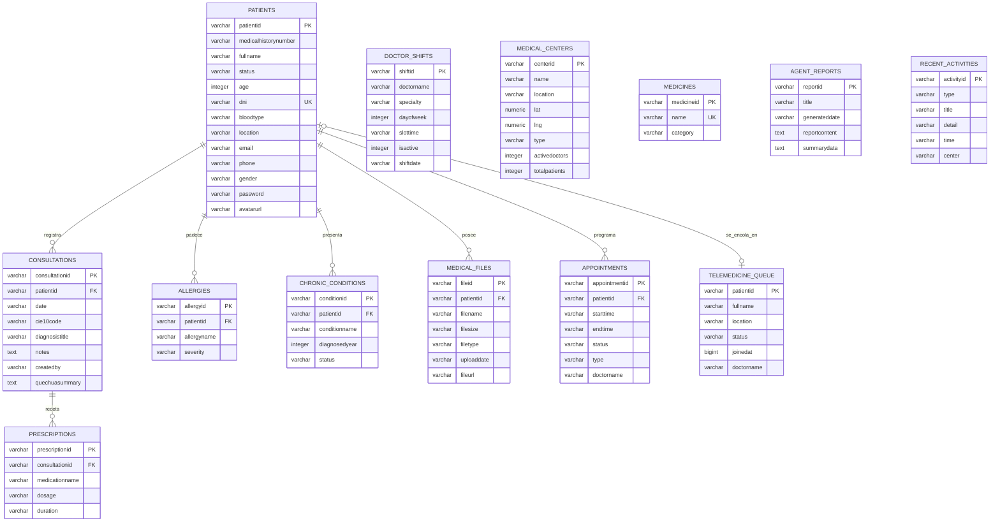

# Modelo Entidad-Relación (MER) - SUMAQ QHALI

Este documento describe el modelo lógico de datos de **SUMAQ QHALI**, detallando las entidades, relaciones, llaves primarias/foráneas y restricciones basadas en el esquema DDL provisto.

---

## 1. Diagrama de Entidad-Relación (Mermaid)

---

## 2. Diccionario de Datos por Entidad

### 2.1 Tabla: `patients` (Pacientes)
Representa el registro maestro de los pacientes del sistema.

| Columna | Tipo | Restricciones | Descripción |
| :--- | :--- | :--- | :--- |
| `patientid` | `character varying` | `PRIMARY KEY` | Identificador único del paciente (UUID o código). |
| `medicalhistorynumber` | `character varying` | `NOT NULL` | Número de expediente de historia clínica (ej: `#HC-2026-X`). |
| `fullname` | `character varying` | `NOT NULL` | Nombre completo del paciente. |
| `status` | `character varying` | `NOT NULL` | Estado del paciente (ej: 'Activo'). |
| `age` | `integer` | `NOT NULL` | Edad en años. |
| `dni` | `character varying` | `NOT NULL, UNIQUE` | Documento Nacional de Identidad del paciente. |
| `bloodtype` | `character varying` | `NOT NULL` | Grupo sanguíneo (ej: 'O+', 'A-'). |
| `location` | `character varying` | `NOT NULL` | Comunidad o localidad rural andina (ej: 'Calca'). |
| `email` | `character varying` | `NULLABLE` | Correo electrónico del paciente. |
| `phone` | `character varying` | `NULLABLE` | Número de teléfono celular. |
| `gender` | `character varying` | `NULLABLE` | Género (Masculino, Femenino, Otro). |
| `password` | `character varying` | `NULLABLE` | Contraseña cifrada para acceso al portal. |
| `avatarurl` | `character varying` | `NULLABLE` | URL de la imagen de perfil del paciente. |

### 2.2 Tabla: `consultations` (Consultas Médicas)
Almacena el registro de las atenciones médicas realizadas a los pacientes.

| Columna | Tipo | Restricciones | Descripción |
| :--- | :--- | :--- | :--- |
| `consultationid` | `character varying` | `PRIMARY KEY` | Identificador único de la consulta. |
| `patientid` | `character varying` | `FOREIGN KEY` | Referencia al paciente atendido (`patients.patientid`). |
| `date` | `character varying` | `NOT NULL` | Fecha de la consulta. |
| `cie10code` | `character varying` | `NOT NULL` | Código de diagnóstico según la clasificación CIE-10. |
| `diagnosistitle` | `character varying` | `NOT NULL` | Descripción corta del diagnóstico. |
| `notes` | `text` | `NULLABLE` | Notas y observaciones clínicas escritas por el médico. |
| `createdby` | `character varying` | `NOT NULL` | Identificación del médico que realizó la consulta. |
| `quechuasummary` | `text` | `NULLABLE` | Resumen de indicaciones y cuidado andino traducido a Quechua por IA. |

### 2.3 Tabla: `prescriptions` (Recetas Médicas)
Detalla los fármacos o preparaciones tradicionales recetadas en una consulta específica.

| Columna | Tipo | Restricciones | Descripción |
| :--- | :--- | :--- | :--- |
| `prescriptionid` | `character varying` | `PRIMARY KEY` | Identificador único de la prescripción. |
| `consultationid` | `character varying` | `FOREIGN KEY` | Referencia a la consulta médica (`consultations.consultationid`). |
| `medicationname` | `character varying` | `NOT NULL` | Nombre del medicamento o hierba medicinal. |
| `dosage` | `character varying` | `NOT NULL` | Dosis y frecuencia de administración. |
| `duration` | `character varying` | `NOT NULL` | Duración recomendada del tratamiento. |

### 2.4 Tabla: `allergies` (Alergias)
Registra las sustancias, fármacos o elementos alergénicos de un paciente.

| Columna | Tipo | Restricciones | Descripción |
| :--- | :--- | :--- | :--- |
| `allergyid` | `character varying` | `PRIMARY KEY` | Identificador único de la alergia registrada. |
| `patientid` | `character varying` | `FOREIGN KEY` | Referencia al paciente (`patients.patientid`). |
| `allergyname` | `character varying` | `NOT NULL` | Nombre del alérgeno (ej: 'Penicilina'). |
| `severity` | `character varying` | `NOT NULL` | Gravedad de la reacción ('Baja', 'Media', 'Alta'). |

### 2.5 Tabla: `chronicconditions` (Condiciones Crónicas)
Almacena patologías de larga duración diagnosticadas en los pacientes.

| Columna | Tipo | Restricciones | Descripción |
| :--- | :--- | :--- | :--- |
| `conditionid` | `character varying` | `PRIMARY KEY` | Identificador único de la condición. |
| `patientid` | `character varying` | `FOREIGN KEY` | Referencia al paciente (`patients.patientid`). |
| `conditionname` | `character varying` | `NOT NULL` | Nombre de la condición o enfermedad crónica. |
| `diagnosedyear` | `integer` | `NOT NULL` | Año del diagnóstico inicial. |
| `status` | `character varying` | `NOT NULL` | Estado de la enfermedad ('Controlado', 'Activo', etc.). |

### 2.6 Tabla: `medicalfiles` (Documentos Clínicos)
Historial de archivos, laboratorios o imágenes médicas subidas al expediente del paciente.

| Columna | Tipo | Restricciones | Descripción |
| :--- | :--- | :--- | :--- |
| `fileid` | `character varying` | `PRIMARY KEY` | Identificador único del archivo. |
| `patientid` | `character varying` | `FOREIGN KEY` | Referencia al paciente (`patients.patientid`). |
| `filename` | `character varying` | `NOT NULL` | Nombre del archivo físico. |
| `filesize` | `character varying` | `NOT NULL` | Tamaño en kilobytes o megabytes. |
| `filetype` | `character varying` | `NOT NULL` | Formato del archivo (ej: 'PDF', 'JPG'). |
| `uploaddate` | `character varying` | `NOT NULL` | Fecha de carga del archivo. |
| `fileurl` | `character varying` | `NULLABLE` | URL remota del archivo almacenado (ej: en Supabase Bucket). |

### 2.7 Tabla: `appointments` (Citas Médicas)
Calendario y agenda de citas programadas para consultas sincrónicas o teleconsultas.

| Columna | Tipo | Restricciones | Descripción |
| :--- | :--- | :--- | :--- |
| `appointmentid` | `character varying` | `PRIMARY KEY` | Identificador único de la cita. |
| `patientid` | `character varying` | `FOREIGN KEY` | Referencia al paciente (`patients.patientid`). |
| `starttime` | `character varying` | `NOT NULL` | Fecha y hora de inicio de la cita. |
| `endtime` | `character varying` | `NOT NULL` | Fecha y hora programada de finalización. |
| `status` | `character varying` | `NOT NULL, CHECK` | Estado limitado a: `Scheduled` (Pendiente), `Completed` (Completada), `Cancelled` (Cancelada) o `InCall` (En llamada). |
| `type` | `character varying` | `NOT NULL` | Especialidad de la cita (ej: 'Medicina General'). |
| `doctorname` | `character varying` | `NULLABLE` | Nombre del profesional asignado. |

### 2.8 Tabla: `telemedicinequeue` (Cola de Telemedicina)
Cola transaccional en tiempo real donde los pacientes esperan atenciones inmediatas por videollamada.

| Columna | Tipo | Restricciones | Descripción |
| :--- | :--- | :--- | :--- |
| `patientid` | `character varying` | `PRIMARY KEY` | Identificador único del paciente (sirve como PK de la cola y se relaciona con `patients.patientid`). |
| `fullname` | `character varying` | `NOT NULL` | Nombre completo del paciente en cola. |
| `location` | `character varying` | `NOT NULL` | Localidad de conexión del paciente. |
| `status` | `character varying` | `NOT NULL` | Estado en cola (ej: 'waiting', 'accepted'). |
| `joinedat` | `bigint` | `NOT NULL` | Marca de tiempo (Epoch Unix millisecond) de ingreso a la cola para ordenamiento FIFO. |
| `doctorname` | `character varying` | `NULLABLE` | Nombre del doctor que atiende o aceptó la llamada. |

---

## 3. Entidades de Soporte y Catálogo

### 3.1 Tabla: `doctorshifts` (Turnos de Médicos)
Define el calendario de turnos y bloques disponibles asignados a los médicos del sistema.

* **Llave Primaria:** `shiftid`
* **Columnas:** `doctorname`, `specialty`, `dayofweek` (0-6), `slottime` (rango horario), `isactive` (1 o 0), `shiftdate` (fecha específica del turno).

### 3.2 Tabla: `medicalcenters` (Puestos y Centros de Salud)
Listado georreferenciado de los puestos de salud andinos que forman parte de la red de telemedicina.

* **Llave Primaria:** `centerid`
* **Columnas:** `name`, `location` (comunidad), `lat` (latitud), `lng` (longitud), `type` (ej: 'Puesto de Salud'), `activedoctors` (médicos disponibles), `totalpatients` (pacientes asignados).

### 3.3 Tabla: `medicines` (Catálogo de Medicamentos)
Maestro de medicamentos científicos habilitados para la emisión de recetas electrónicas de manera segura.

* **Llave Primaria:** `medicineid`
* **Columnas:** `name` (UNIQUE, ej: 'Amoxicilina 500mg'), `category` (ej: 'Antibiótico').

### 3.4 Tabla: `agentreports` (Reportes del Agente IA)
Colección de análisis sanitarios y resúmenes epidemiológicos generados de forma automatizada por el Agente de IA.

* **Llave Primaria:** `reportid`
* **Columnas:** `title`, `generateddate`, `reportcontent` (JSON o texto del análisis clínico), `summarydata` (KPIs calculados de la red).

### 3.5 Tabla: `recentactivities` (Bitácora de Eventos)
Registro cronológico de actividades operativas en la red para auditorías de administración.

* **Llave Primaria:** `activityid`
* **Columnas:** `type` (ej: 'Consulta'), `title`, `detail`, `time` (timestamp), `center` (puesto de salud de procedencia).
